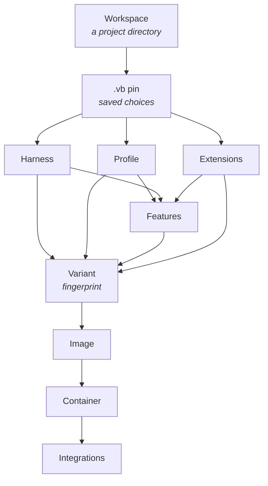

# Core concepts

Vibrator has a small vocabulary. Once these seven terms click, the rest of the tool is
just detail.

## Workspace

A **workspace** is a project directory. Vibrator finds it by walking up from your current
directory to the **git root** (or, if you're not in a repo, the filesystem root) looking
for a [`.vb` file](../guides/configuration.md). The workspace is mounted into the
container at the *same absolute path* it has on your host — so `pwd`, stack traces, and
error messages all match your host muscle memory.

## Harness

A **harness** is the AI coding agent that runs inside the container. Vibrator ships four
built-ins:

| ID | Agent |
|----|-------|
| `claude-code` | [Claude Code](../guides/harnesses.md#claude-code) (Anthropic) |
| `codex` | [OpenAI Codex](../guides/harnesses.md#codex) |
| `opencode` | [OpenCode](../guides/harnesses.md#opencode) (SST) |
| `pi` | [Pi](../guides/harnesses.md#pi) (`pi-coding-agent`) |

Each harness declares how to install itself, which auth env vars it expects, which base
[features](#feature) it requires, and the command `vibrate` execs to launch it. Bare
`vibrate` launches the harness's own CLI; [`vibrate shell`](../reference/commands/launch.md#vibrate-shell)
launches your shell instead.

## Profile

A **profile** is a named bundle of [features](#feature) — a starting point you tune with
`--with`/`--no`. There are four, ordered smallest to largest:

| Profile | Roughly |
|---------|---------|
| `minimal` | Base toolkit only (jq, rg, fd, vim, git, …) |
| `backend` | + Python, Go, GitHub CLI, Postgres client |
| `frontend` | + Node, Bun, Playwright/Chromium |
| `full` *(default)* | Backend + frontend + audit toolkit + Codex CLI |

See the [Profiles reference](../reference/profiles.md) for the exact feature lists.

## Feature

A **feature** is a build-time capability layer — a language toolchain (`python`, `go`,
`node`), a browser runtime (`playwright`), a CLI (`gh`, `postgres-client`), or a tool
bundle (`audit-toolkit`). Features carry their own Dockerfile fragments and declare
dependencies on each other. The resolver:

1. Starts with the profile's features.
2. Adds features required by the harness and any selected extensions.
3. Applies your `--with` (add) and `--no` (remove) deltas.
4. **Auto-enables transitive dependencies** (selecting `playwright` pulls in `node`).

See the [Features reference](../reference/features.md) for the full catalogue.

## Extension

An **extension** is something installed *on top of* the harness — an MCP server, a skill,
a subagent, or a whole bundle like [ECC](../guides/ecc.md). The catalogue is a set of
Markdown files with YAML frontmatter, one per item, scoped per harness under
`extensions/<harness>/`. You pick them by ID (`--extensions=context7,ecc-developer` or in
the wizard) and they're installed at image-build time. See [Extensions](../guides/extensions.md).

## Variant

A **variant** is a unique `(harness, shell, features, extensions, user)` combination,
identified by an 8-character SHA-256 **fingerprint**. The fingerprint is what makes
isolation work:

- It determines the [**image tag**](../reference/naming-and-labels.md)
  (`vb-<harness>-<profile>-<user>-<fp8>:latest`).
- It distinguishes [**container names**](../reference/naming-and-labels.md), so
  Claude Code "backend" and Codex "backend" in the same project get *two* containers.

Profile is deliberately *not* part of the fingerprint — it's just a label for a feature
bundle, so `--profile=full` and the implicit default resolve identically. See
[Naming & labels](../reference/naming-and-labels.md).

## Integration

An **integration** connects the container to a **host-side service** — for example
[Serena](../integrations/serena.md) (a code-aware MCP server) or
[claude-mem](../integrations/claude-mem.md) (persistent agent memory). Integrations wire
themselves into the container via a build-time manifest and an on-every-entry probe that
picks the right transport (HTTP to the host server, or a container-local fallback). You
control the policy per workspace with a [hosting mode](../guides/integrations.md#hosting-modes):
`auto`, `host`, `local`, or `off`.

---

## How they fit together

When you run `vibrate`:

1. The **workspace** is located and its **`.vb` pin** loaded (or the
   [wizard](../reference/commands/wizard.md) fills it in).
2. The pin's **harness** + **profile** + **extensions** resolve into a final **feature**
   set.
3. That combination is the **variant**, hashed into a fingerprint that names the
   **image** and **container**.
4. The image is built if missing; the container is run or re-entered.
5. On entry, **integrations** and credentials are wired in.

The next two sections go deep on steps 3–5: [What happens on build](../lifecycle/build.md)
and [What happens on start](../lifecycle/startup.md).

## Related pages

- [Naming & labels](../reference/naming-and-labels.md) — how the variant fingerprint names things.
- [Profiles & features](../guides/profiles-and-features.md) — how profiles resolve into features.
- [Architecture](../reference/architecture.md) — the internal module map behind these terms.
