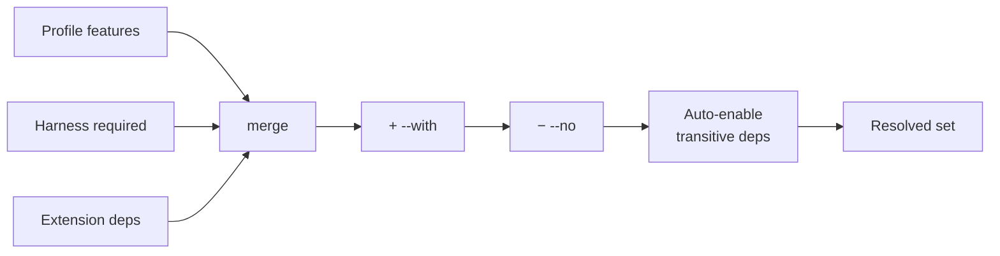

# Profiles & features

A **profile** is a named starting bundle of **features**, and features are the build-time
capability layers (language toolchains, browser runtime, CLIs, tool bundles) that make up
an image. This guide explains how they combine and how resolution works. For the complete
catalogues, see the [Profiles reference](../reference/profiles.md) and the
[Features reference](../reference/features.md).

## Profiles are a starting point

Pick one with `--profile=<id>` (default `full`). It seeds the feature set; you tune it from
there.

| Profile | Best for | Features |
|---------|----------|----------|
| `minimal` | a shell-in-a-box, CI, tight resources | *(none — base toolkit only)* |
| `backend` | Python/Go services | `python`, `go`, `gh`, `postgres-client`, `ralphex` |
| `frontend` | web/UI work | `node`, `playwright`, `gh`, `ralphex` |
| `full` *(default)* | everything except `aider` | `python`, `go`, `node`, `playwright`, `gh`, `postgres-client`, `audit-toolkit`, `codex-cli`, `ralphex` |

The base toolkit (jq, ripgrep, fd, fzf, vim, git, curl, ssh, …) is **always** present
regardless of profile — it's baked into [Stage 1](../lifecycle/build.md#stage-1-base).

## Tuning with `--with` and `--no`

Layer deltas on top of the profile:

```bash
# Backend, plus a browser, minus the autonomous loop tool.
vibrate --profile=backend --with=node,playwright --no=ralphex

# Minimal, but add just Python.
vibrate --profile=minimal --with=python
```

These persist in [`.vb`](configuration.md) as `with` / `no`.

## How resolution works

The final feature set is computed like this:



1. Start with the **profile's** features.
2. Add features **required by the harness** (e.g. Codex needs `node`) and by any selected
   **extensions** (their `deps.features`).
3. Apply **`--with`** (add) then **`--no`** (remove).
4. **Auto-enable transitive dependencies**: selecting `playwright` pulls in `node`;
   `audit-toolkit` pulls in `python`.

Features are emitted into the Dockerfile in dependency order (deps before dependents), so
the build is deterministic.

### A subtlety: deps win over `--no`

If you remove a feature that something else still needs, it gets auto-re-enabled. For
example `--no=node --with=playwright` keeps `node`, because Playwright depends on it. To
truly drop it, also drop its dependent (`--no=node,playwright`). This "auto-enable deps"
behavior is intentional — it's friendlier than failing the build.

## Why profile isn't in the fingerprint

The [variant fingerprint](../reference/naming-and-labels.md) is computed from the *resolved
feature set*, not the profile label. So `--profile=full` and the implicit default (which
resolves to `full`) produce the **same** image — the profile is purely a UX shorthand. Two
specs that resolve to identical features share an image even if you named the profile
differently.

## Image size

Profiles carry rough size estimates (informational only): `minimal` ~150 MB, `backend`
~600 MB, `frontend` ~1 GB, `full` ~2 GB. Reach for `minimal` + targeted `--with` when image
size or build time matters.

## Related

- [Profiles reference](../reference/profiles.md) — the canonical bundles.
- [Features reference](../reference/features.md) — every feature, its deps, and what it
  installs.
- [What happens on build](../lifecycle/build.md) — where features land in the Dockerfile.
