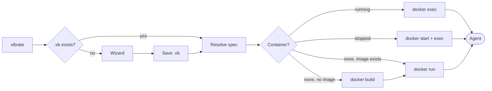

# Vibrator

**Run AI coding agents in disposable, per-workspace Docker sandboxes — configured by a single `.vb` file.**

Vibrator (`vibrate`, alias `vb`) is a single Go binary that builds a tailored Docker
image for each of your projects and drops you straight into an AI coding agent —
[Claude Code](guides/harnesses.md#claude-code), [Codex](guides/harnesses.md#codex),
[OpenCode](guides/harnesses.md#opencode), or [Pi](guides/harnesses.md#pi) — running
inside it. The agent gets a full toolchain, your host credentials, and your project
mounted at the same absolute path, while staying isolated from the rest of your machine.

```bash
cd ~/my-project
vibrate          # wizard fills the gaps, image builds, agent drops you in
```

The first run writes a [`.vb` file](guides/configuration.md) capturing your choices, so
every subsequent `vibrate` in that workspace reuses the container and jumps in instantly.

---

## Why use it?

<div class="grid cards" markdown>

-   :material-cube-outline:{ .lg .middle } **Isolation per workspace**

    ---

    Each project gets its own image and container, keyed by a content
    [fingerprint](reference/naming-and-labels.md). Two projects never share state, and
    the agent can't touch anything outside the mounted workspace.

-   :material-tune-variant:{ .lg .middle } **Declarative configuration**

    ---

    A small [`.vb` TOML file](reference/vb-file.md) pins the harness, profile, features,
    extensions, and LLM provider. Commit-free, gitignored, reproducible.

-   :material-toolbox-outline:{ .lg .middle } **Batteries included**

    ---

    [Profiles](reference/profiles.md) bundle Python, Go, Node, Playwright, a security
    [audit toolkit](reference/features.md), and more — resolved with dependency-aware
    [feature](reference/features.md) layering.

-   :material-puzzle-outline:{ .lg .middle } **Curated extensions**

    ---

    A per-harness [extensions catalogue](guides/extensions.md) of MCP servers, skills,
    agents, and bundles like [ECC](guides/ecc.md) — installed at build time.

-   :material-lan-connect:{ .lg .middle } **Host integrations**

    ---

    [Serena](integrations/serena.md) and [claude-mem](integrations/claude-mem.md) wire
    host-side services into the container with automatic transport fallback — no manual
    Docker networking.

-   :material-key-variant:{ .lg .middle } **Credentials, not secrets**

    ---

    Your OAuth tokens, API keys, GPG agent, and AWS credentials are
    [forwarded](guides/authentication.md) into the container — never baked into the image.

</div>

---

## How it works in 30 seconds



1. **Resolve** — `vibrate` reads the workspace `.vb`, overlays any CLI flags, and runs
   the [wizard](reference/commands/wizard.md) for anything still unset.
2. **Build** — it generates a deterministic [Dockerfile](lifecycle/build.md) for the
   resolved spec and builds the image (only when one doesn't already exist).
3. **Launch** — it runs or re-enters the container, mounting your workspace and
   [forwarding credentials](lifecycle/startup.md), then execs the harness's own CLI.

See [What happens on build](lifecycle/build.md) and
[What happens on start](lifecycle/startup.md) for the full step-by-step.

---

## Get started

<div class="grid cards" markdown>

-   :material-download:{ .lg .middle } **[Install](getting-started/installation.md)**

    ---

    Build the binary, put it on `$PATH` with a `vb` alias, and register shell completion.

-   :material-rocket-launch-outline:{ .lg .middle } **[Quick start](getting-started/quickstart.md)**

    ---

    Your first `vibrate` run, the wizard, and what the `.vb` file captures.

-   :material-school-outline:{ .lg .middle } **[Core concepts](getting-started/concepts.md)**

    ---

    Workspace, variant, harness, profile, feature, extension, integration — the vocabulary.

-   :material-help-circle-outline:{ .lg .middle } **[FAQ](faq.md)**

    ---

    Quick answers to common questions.

</div>

---

!!! info "Status"
    Vibrator is a Go program. Docker integration is done by shelling out to the `docker`
    CLI (no SDK dependency), so any Docker-compatible runtime works —
    [Docker Desktop, OrbStack, Colima, Rancher Desktop, Podman, or native](lifecycle/runtime-detection.md).
    Released under the **MIT** license.
