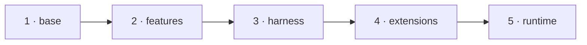

# What happens on build

When `vibrate` needs an image — because no image exists for the resolved
[variant](../getting-started/concepts.md#variant), or you passed `--rebuild` /
ran [`vibrate build`](../reference/commands/build.md) — it generates a **deterministic
Dockerfile** and runs `docker build`. Same spec in, byte-identical Dockerfile out. That
determinism is what powers golden-file tests, content-based image fingerprints, and
[`vibrate build-dockerfile`](../reference/commands/build.md#vibrate-build-dockerfile) for
inspection.

You can see exactly what would be built, without building it:

```bash
vibrate build-dockerfile --harness=claude-code --profile=full --shell=zsh
```

## The build context

`vibrate` does **not** send your workspace to the Docker daemon as the build context.
Instead it creates a small temporary directory containing only Vibrator-owned files,
extracted from templates embedded in the binary:

```
<tempdir>/
├── shells/
│   ├── bashrc
│   ├── zshrc
│   └── config.fish
├── scripts/
│   ├── entrypoint.sh
│   ├── claude-exec.sh
│   └── welcome.sh
└── integrations.json     # per-harness MCP wiring (generated at build time)
```

!!! note "Why a dedicated context"
    Using your working directory as the build context would stream the whole project to
    the daemon on every build — wasteful — and a stray `Dockerfile` in your project could
    shadow the generated one. The workspace is mounted later, at `docker run` time, not
    `docker build` time.

These build args are passed so file permissions on the mounted workspace match you:

```
--build-arg USERNAME=<your sanitized host username>
--build-arg HOST_UID=<your uid>
--build-arg HOST_GID=<your gid>
```

## The five stages

The generated Dockerfile is a multi-stage build. Each stage is a named cache boundary, so
changing a feature doesn't rebuild the base toolkit, and changing an extension doesn't
rebuild the harness.



The file begins with a `# syntax=docker/dockerfile:1.7` directive (BuildKit is required —
it enables the heredoc `RUN` blocks used for extension installs) and a self-documenting
header comment recording the harness, profile, shell, features, extensions, and the exact
`vibrate build-dockerfile` command that reproduces it.

### Stage 1 — `base`

`FROM ubuntu:24.04 AS base`. The always-on substrate every profile gets:

1. **System packages** via `apt-get` — `ca-certificates curl wget`, `git gpg
   openssh-client`, `sudo vim less tree`, `jq sqlite3 dnsutils`, `unzip xz-utils`,
   `build-essential`, `locales`, zsh autosuggestions/syntax-highlighting,
   `bash-completion`, plus **your chosen shell**.
2. **Shell rc files** copied into `/etc/skel/` (`.bashrc`, `.zshrc`,
   `.config/fish/config.fish`) — all three regardless of your login shell, so invoking
   any shell inside the container doesn't trip its first-run wizard. `/etc/skel` means the
   later `useradd -m` copies them into the user's home automatically.
3. **Vibrator scripts** — `welcome.sh` into `/opt/vibrator/`, `entrypoint.sh` into
   `/opt/vibrator/`, and the `claude-exec` wrapper into `/usr/local/bin/`.
4. **Integrations manifest** copied to `/etc/vibrator/integrations.json`.
5. **Build sentinel** — `echo "<build-id>" > /etc/vibrator/build`, so you can identify the
   image an old container came from (`cat /etc/vibrator/build`).
6. **Locale + PATH env** — `LANG/LC_ALL=en_US.UTF-8`, `COLORTERM=truecolor`, and uv
   install-dir hints (`UV_TOOL_BIN_DIR=/usr/local/bin`,
   `UV_PYTHON_INSTALL_DIR=/opt/uv-python`).
7. **ripgrep** (multi-arch binary release) and **fd** + **fzf** (apt).

### Stage 2 — `features`

`FROM base AS features`. For each resolved [feature](../reference/features.md), in
dependency order, the generator emits that feature's Dockerfile fragment with a
`# --- feature: <id> ---` banner. Fragments may be any Dockerfile directives — several use
multi-stage `COPY --from` (Go and Node copy from the official images; Python installs via
`uv`).

At the **end of this stage** the unprivileged user is created — a deliberate privilege
boundary:

```dockerfile
ARG USERNAME=<you>
ARG HOST_UID=<uid>
ARG HOST_GID=<gid>

# Remove any pre-existing user/group at the target UID/GID
# (Ubuntu ships "ubuntu" at 1000, which usually clashes).
RUN ... userdel ... groupdel ...
RUN groupadd -g ${HOST_GID} ${USERNAME} \
 && useradd -m -s /bin/<shell> -u ${HOST_UID} -g ${HOST_GID} ${USERNAME} \
 && echo "${USERNAME} ALL=(root) NOPASSWD:ALL" > /etc/sudoers.d/${USERNAME}

USER ${USERNAME}
WORKDIR /home/${USERNAME}
```

!!! info "Why everything before the USER switch runs as root"
    System package installs and multi-stage copies need root. After the switch, the
    harness and extension installs run as *you* — so `claude.ai/install.sh` lands in
    `~/.local/bin`, plugins write to `~/.claude/`, and there's no unreadable-`/root`
    traversal problem at runtime.

Immediately after the switch, the install-destination env vars are **overridden** to
user-writable paths (this is critical — they persist from Stage 1, where they pointed at
system dirs the unprivileged user can't write):

```dockerfile
ENV NPM_CONFIG_PREFIX=/home/${USERNAME}/.npm-global
ENV UV_TOOL_BIN_DIR=/home/${USERNAME}/.local/bin
ENV PATH=/home/${USERNAME}/.npm-global/bin:/home/${USERNAME}/.local/bin:/usr/local/go/bin:...
```

### Stage 3 — `harness`

`FROM features AS harness`. Installs the selected [harness](../guides/harnesses.md) binary
by emitting its install fragment. Examples:

- **claude-code** — `curl -fsSL https://claude.ai/install.sh | bash`, then symlink into
  `/usr/local/bin/claude`.
- **codex** — `npm install -g @openai/codex` (requires the `node` feature).
- **opencode** — architecture-aware download of the prebuilt binary from GitHub Releases.
- **pi** — `npm install -g @mariozechner/pi-coding-agent` (requires `node`).

### Stage 4 — `extensions`

`FROM harness AS extensions`. For each selected [extension](../guides/extensions.md),
sorted by ID for determinism, the generator wraps the extension's `install:` shell snippet
in a BuildKit heredoc `RUN` block:

```dockerfile
# --- extensions/claude-code/context7 (mcp) ---
# Source: https://github.com/upstash/context7
RUN <<'VIBRATE_EXT_INSTALL'
set -e
claude mcp add context7 --scope user --transport http https://mcp.context7.com/mcp
VIBRATE_EXT_INSTALL
```

The unusual delimiter (`VIBRATE_EXT_INSTALL`) avoids collisions with `EOF` heredocs inside
the snippets themselves; the generator refuses to build if a snippet uses the reserved
delimiter on its own line. `set -e` makes a failed command abort the build.

### Stage 5 — `runtime`

`FROM extensions AS runtime`. No more installs — this stage stamps metadata and sets the
default command:

1. **Auth env-var declarations** — each of the harness's auth env vars is declared empty
   (`ENV ANTHROPIC_API_KEY=""`). Real values are injected at `docker run`, never baked in.
2. **Variant metadata as env vars**, readable inside the container — `VIBRATOR_HARNESS`,
   `VIBRATOR_PROFILE`, `VIBRATOR_FEATURES_LIST`, `VIBRATOR_EXTENSIONS_LIST`,
   `VIBRATOR_VERSION`, `VIBRATOR_BUILD_ID`.
3. **Labels** for image management — `vibrator.version`, `vibrator.build_id`,
   `vibrator.harness`, `vibrator.profile`, `vibrator.shell`, `vibrator.features`,
   `vibrator.extensions`. These drive [`vibrate variants list`](../reference/commands/variants.md).
4. **`ENTRYPOINT ["/opt/vibrator/entrypoint.sh"]`** — runs the host-config merge on every
   container start (see [What happens on start](startup.md)).
5. **`CMD ["/usr/local/bin/claude-exec", "/bin/<shell>"]`** — the default command, wrapped
   so the per-session integration probes fire even if someone runs the image directly with
   plain `docker run`.

## Build invocation

The orchestrator pipes the generated Dockerfile to `docker build` via stdin (`-f -`) with
the temp build context, the [computed image tag](../reference/naming-and-labels.md), and
the three build args above. `--no-cache` is added when you pass `--rebuild` (or
`vibrate build --no-cache`).

## Result

A tagged image like `vb-claude-code-full-you-a1b2c3d4:latest`. From here the orchestrator
moves on to [running the container](startup.md).

## Related

- [`vibrate build`](../reference/commands/build.md) — build without running.
- [`vibrate build-dockerfile`](../reference/commands/build.md#vibrate-build-dockerfile) —
  emit the Dockerfile for inspection.
- [Features](../reference/features.md) and [Profiles](../reference/profiles.md) — what
  goes into Stage 2.
- [Naming & labels](../reference/naming-and-labels.md) — how the image tag is computed.
