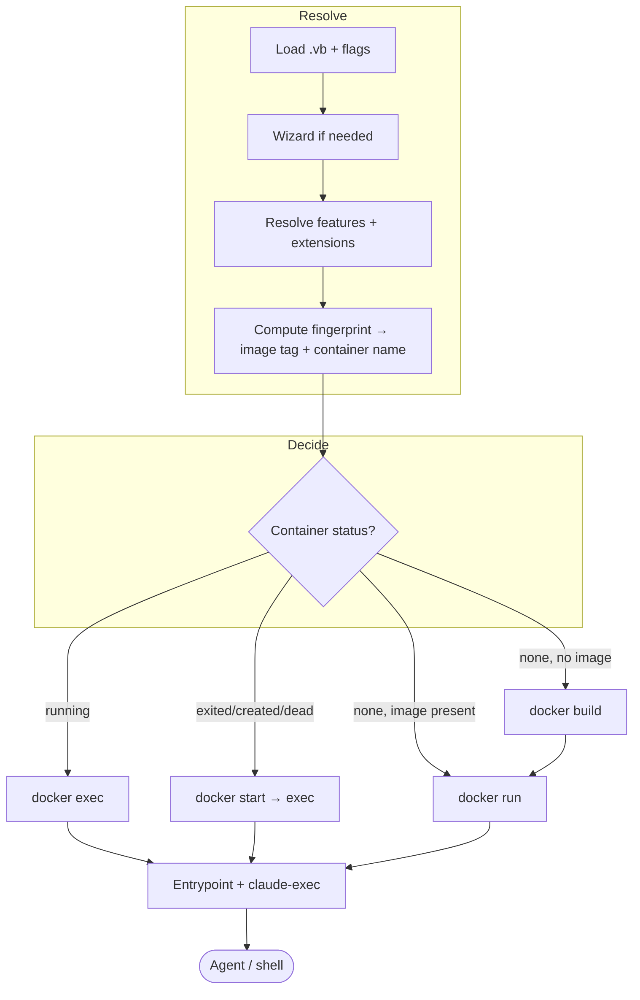

# Lifecycle

This section describes, step by step, exactly what Vibrator does at the two moments that
matter most:

-   :material-hammer-wrench:{ .lg .middle } **[What happens on build](build.md)**

    ---

    The deterministic five-stage Dockerfile generator — every layer, in order, from the
    Ubuntu base to the final `ENTRYPOINT`/`CMD`.

-   :material-play-circle-outline:{ .lg .middle } **[What happens on start](startup.md)**

    ---

    The `docker run` invocation, then the entrypoint and the per-session `claude-exec`
    wrapper — config merging, rules, settings, MCP wiring, and credential plumbing.

-   :material-docker:{ .lg .middle } **[Runtime detection](runtime-detection.md)**

    ---

    How `vibrate` finds your Docker socket across Docker Desktop, OrbStack, Colima,
    Rancher Desktop, Podman, and native Linux.

## The big picture

The **Resolve** and **Decide** phases live in the orchestrator (`internal/app`). The
[build](build.md) happens only when no matching image exists (or you pass `--rebuild`).
The [startup wiring](startup.md) runs inside the container on every entry.

## Where the decision is made

`vibrate` inspects the container by its [computed name](../reference/naming-and-labels.md)
and branches:

| Container state | What `vibrate` does |
|-----------------|---------------------|
| Running | `docker exec` straight in |
| Exited / created / dead | `docker start`, then `docker exec` |
| Missing, image exists | `docker run` (skips build) |
| Missing, no image | `docker build`, then `docker run` |
| `--rebuild` passed | Remove any container, rebuild `--no-cache`, run fresh |

This is the entire reason the first run in a workspace is slow and every run after is
instant: the expensive `docker build` only happens when the resolved variant has no image
yet.
