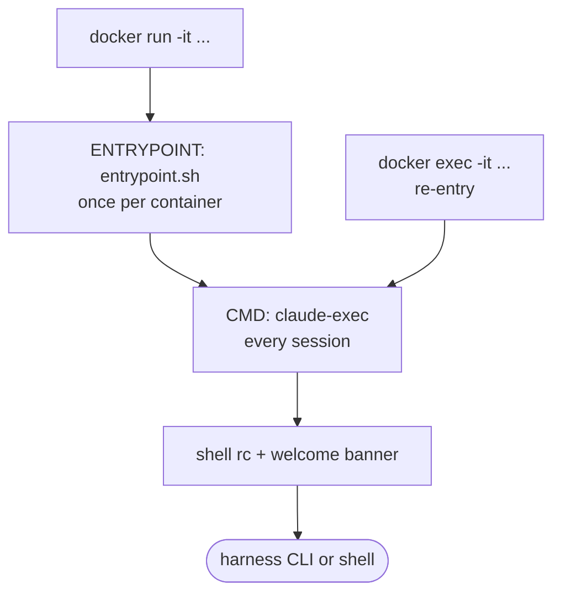

# What happens on start

Once an image exists, `vibrate` brings the container up and wires it into your host. There
are three layers of runtime behavior, in order:

1. The **`docker run` invocation** — flags, mounts, and forwarded environment.
2. The **entrypoint** (`entrypoint.sh`) — runs **once** when the container is created.
3. The **`claude-exec` wrapper** — runs on **every** session entry (`docker run` *and*
   every `docker exec` re-entry), then your shell's rc and the welcome banner.



!!! important "Entrypoint vs. exec"
    `docker exec` does **not** re-run the entrypoint. That's why per-session wiring
    (integration transport probes, workspace `cd`, trust acceptance) lives in
    `claude-exec` instead — so re-entering an already-running container still picks up
    host-side changes.

---

## 1. The `docker run` invocation

For a normal launch the orchestrator runs the container interactively (`-it`) so you drop
into a session and control returns when you exit. The key flags:

| Flag | Value | Why |
|------|-------|-----|
| `--name` | [computed container name](../reference/naming-and-labels.md) | enables later `docker exec` re-entry |
| `--hostname` | `vibrate-<workspace-basename>` | makes the shell prompt visibly "inside a box" |
| `--workdir` | the workspace path | land in the project, not `$HOME` |
| `--init` | (tini as PID 1) | reaps zombie processes, forwards `Ctrl-C` correctly |
| `--shm-size` | `2g` | Docker's default 64 MB crashes Chromium/Playwright |
| `--add-host` | `host.docker.internal:host-gateway` | container can reach host services |
| `--label` | `vibrator.*` | discoverable by [`vibrate variants`](../reference/commands/variants.md) |

The default command is the [harness](../guides/harnesses.md) CLI (or your shell for
[`vibrate shell`](../reference/commands/launch.md#vibrate-shell)), always prefixed with
`/usr/local/bin/claude-exec` so the per-session wiring runs first.

### Mounts

| # | Host source | Container target | Mode | Condition |
|---|-------------|------------------|------|-----------|
| — | **the workspace** | same absolute path | rw | always |
| D1 | `~/.claude.json` | `~/.claude.host.json` | ro | claude-code, file exists |
| D2 | `~/.claude/settings.json` | `~/.claude/settings.host.json` | ro | claude-code, file exists |
| D3 | `~/.claude/rules/` | `~/.claude/rules-host/` | ro | claude-code, dir exists |
| D4 | `~/.claude/hooks/` | `~/.claude/hooks/` | rw | claude-code, dir exists |
| D5a | `~/.claude/projects/<encoded-cwd>/` | same (scoped) | rw | claude-code |
| D5b | `~/.claude/{file-history,sessions,tasks,paste-cache}` | same | rw | claude-code |
| D6 | `~/.aws` | `~/.aws` | ro | dir exists |
| D7 | `~/.cache/vibrator/claude-mem/<wsHash>` | `~/.claude-mem/cache` | rw | claude-mem extension selected |
| D8 | host Docker socket | `/var/run/docker.sock` | rw | `--dind` |
| D9 | gpg-agent extra-socket | `/gpg-agent-extra` | rw | gpg `extra-socket` configured |

The workspace mount at the **same absolute path** is the foundational design choice — it
makes paths in errors, stack traces, and `pwd` identical inside and out. The Claude state
mounts (D1–D5) give you session continuity and let the entrypoint seed the container's
`~/.claude/` from your host config. The `projects/` mount is scoped to *only this
workspace's* transcript subdirectory so other projects' histories don't leak in. See
[Authentication](../guides/authentication.md) and
[Docker-in-Docker](../guides/docker-in-docker.md) for D8/D9 details.

### Forwarded environment

`WORKSPACE_PATH` is always set. On top of it, env vars are layered (later wins on
collision):

1. **Harness auth env vars** — host values for e.g. `CLAUDE_CODE_OAUTH_TOKEN`,
   `ANTHROPIC_API_KEY`, `OPENAI_API_KEY` (forwarded only when set on the host).
2. **LLM-derived vars** from [`[llm]`](../reference/vb-file.md#llm) (for provider-agnostic
   harnesses) — the harness maps your provider/model/key into the right shape.
3. **[Extension](../guides/extensions.md) `auth.env` vars** — host values declared by selected extensions.
4. **`[env]` overrides** from `.vb` — literal values, or `$NAME` indirection resolved
   against the host environment at run time.
5. **`VIBRATOR_INTEGRATION_MODE_<ID>`** — your per-integration
   [hosting mode](../guides/integrations.md#hosting-modes).
6. **`CLAUDE_MEM_*`** — when [claude-mem](../integrations/claude-mem.md) is bootstrapped
   for this workspace.

See the [Environment variables reference](../reference/environment-variables.md) for the
complete list.

---

## 2. The entrypoint (`entrypoint.sh`)

Runs once, as PID 1, before exec'ing your command. It is POSIX `sh`, tolerates every
input being missing, and **never blocks startup** on a failure. Set `VIBRATOR_VERBOSE=1`
to see what each step did. In order:

1. **Create the workspace parent dir** — if the workspace's parent doesn't exist, `sudo
   mkdir -p` it so `git clone ..` / `cd ..` flows work.
2. **`cd` to the workspace** — belt-and-suspenders alongside `--workdir`.
3. **Merge host Claude config** — extract the OAuth/onboarding subset from
   `~/.claude.host.json` (read-only host mount) and deep-merge it into the container's
   writable `~/.claude.json`, so the agent doesn't re-prompt onboarding.
4. **Copy host rules** — copy every `*.md` from `~/.claude/rules-host/` into
   `~/.claude/rules/`. Done on *every* start, so editing a rule on the host takes effect
   next launch with no rebuild.
5. **Generate a user-identity rule** — write `~/.claude/rules/user-identity.md` telling the
   agent to use your real username in generated code instead of `your-name` placeholders.
6. **Merge `settings.json`** — the trickiest step. Snapshot any plugin hooks baked into the
   image, copy host `settings.host.json`, rewrite macOS-style `/Users/.../​.claude/` hook
   paths to the container's `$HOME/.claude/`, then merge the baked hooks back per-event so
   both host and plugin hooks fire.
7. **Ensure baseline files** — create empty `~/.claude.json` / `~/.claude/settings.json`
   if still missing.
8. **claude-mem auth probe** — when `CLAUDE_MEM_RUNTIME=server-beta`, write
   `~/.claude-mem/settings.json` from the forwarded env, probe `/healthz`, then
   `POST /v1/events` with the bearer token and surface the result (`auth OK` /
   `auth REJECTED`). See [claude-mem](../integrations/claude-mem.md).
9. **Re-permission plugin hooks** — `chmod +x` every `*.sh` under `~/.claude/plugins/`
   (bind mounts can strip the executable bit).
10. **Link the GPG agent socket** — if `/gpg-agent-extra` is mounted, symlink it where gpg
    expects, so `git commit -S` uses your host key without it ever leaving the host.
11. **Prune per-profile MCPs** — drop `mcpServers` entries (playwright, serena, claude-mem)
    whose feature isn't in `VIBRATOR_FEATURES_LIST`, so a lean profile doesn't spawn them.
12. **Re-enable baked plugins** — merge plugins installed at build time back into
    `settings.json`'s `enabledPlugins` (step 6's host copy would otherwise hide them).
13. **De-duplicate integration MCPs** — disable any Claude Code plugin whose name collides
    with an integration-managed MCP, so the host-aware integration is the single source.
14. **Skip hooks needing a missing tool** — strip any hook whose command shells out to a
    tool that isn't on `PATH` (checked with `command -v`), logging which tools were skipped.
    Stops node/python hooks from erroring on every event under a lean profile. See
    [Missing-tool hooks](#missing-tool-hooks).
15. **Drop the readiness sentinel** — `touch /tmp/.vibrator-entrypoint-done` (used by
    [`--login`](../guides/authentication.md#vibrate-login)), then `exec "$@"`.

---

## 3. The `claude-exec` wrapper

`claude-exec` runs on *every* session entry — it's the `CMD` prefix on `docker run` and the
exec command on every `docker exec`. It refreshes anything that can change between
sessions, then execs your real command. It uses no `set -e` (a probe failure must never
block your shell). In order:

1. **Accept the workspace trust dialog** — set
   `projects[<workspace>].hasTrustDialogAccepted = true` in `~/.claude.json` (the
   workspace is the whole point of the container).
2. **Process the integrations manifest** — for each entry in
   `/etc/vibrator/integrations.json` matching the current harness, resolve its
   [hosting mode](../guides/integrations.md#hosting-modes) and wire the MCP transport into
   `~/.claude.json`:
    - **`off`** — remove the entry.
    - **`local`** — write the stdio command unconditionally.
    - **`host`** — write the http entry; warn loudly (no fallback) if unreachable.
    - **`auto`** (default) — probe the http URL; on success write http, otherwise fall back
      to stdio with a visible warning.

    Any env vars the entry declares are exported into the session.
3. **`cd` to the workspace** — re-applied here because `docker exec` skips the entrypoint.
4. **`exec "$@"`** — replace the wrapper with the harness CLI (or your shell).

### Shell rc and the welcome banner

After `claude-exec` execs your shell, its rc file (`~/.bashrc` / `~/.zshrc` /
`config.fish`) runs:

- History sizing, a color-coded prompt showing `you@vibrate-<workspace>`, and convenience
  aliases — notably `claude` aliased to `claude --dangerously-skip-permissions` (the
  container *is* the sandbox; `claude-safe` is the escape hatch back to the normal
  permission flow).
- `GIT_SSH_COMMAND` set to skip host-key prompts on first clone (the sandbox is ephemeral).
- Sourcing `/opt/vibrator/welcome.sh`, which prints the banner: detected harness CLIs +
  versions, auth status, profile, tools, extensions, and the workspace path. Silence it
  with `VIBRATOR_NO_BANNER=1`.

---

## Missing-tool hooks

Claude Code hooks are shell commands in `~/.claude/settings.json`. If a hook shells out to a
tool the image doesn't install — e.g. a `node`-based formatter hook under the `minimal`
[profile](../reference/profiles.md) — it fails on **every** matching event with
`node: not found`. Vibrator handles this on two independent levels:

**At launch (host).** Before building or running, `vibrate` scans your host
`~/.claude/settings.json` for hooks that need a tool not in the resolved
[feature set](../reference/features.md). On an interactive run it prompts per gap:

```
⚠  [hooks] 2 hook(s) call `node`, installed by `node` — not in this image
     e.g. node /Users/you/.claude/hooks/format.js
     The container will skip them. Install `node` and rebuild? [y/N]
```

- **y** → adds the feature to `.vb` `with`, so the next build bakes it and the hooks run.
- **N** → records the choice in [`.vb` `[hooks]`](../reference/vb-file.md#hooks) so you're
  not asked again for that tool.
- Non-interactive runs (CI, pipes) just print a one-line warning and continue.

**At runtime (container).** The [entrypoint](#2-the-entrypoint-entrypointsh) strips any hook
whose tool isn't actually on `PATH`, so the agent never sees the per-event error. Because it
checks real availability (`command -v`), a tool installed by some other means is respected.
This layer also covers hooks installed by plugins/extensions and non-interactive runs. Set
`VIBRATOR_VERBOSE=1` (or watch for the one-line `hooks: skipped …` summary) to see what was
removed.

The two layers are independent: the launch prompt offers the *install* path; the entrypoint
guard is the always-on safety net that silences the noise either way.

## The `--login` variant

[`vibrate --login`](../guides/authentication.md#vibrate-login) changes the run flow: the
container starts **detached** with `sleep infinity` so the entrypoint can finish its full
setup, `vibrate` polls for the readiness sentinel, then it execs `claude auth login`,
intercepts the OAuth URL and opens it in your host browser, writes the resulting auth back
to your host `~/.claude.json`, and finally execs the harness. Every other path
(`running`, `exited`, plain `run`) gets the login step injected at the right moment.

## Related pages

- [What happens on build](build.md) — how the image being run was produced.
- [Authentication](../guides/authentication.md) — auth env vars, `--login`, GPG, AWS.
- [Integrations](../guides/integrations.md) — hosting modes and transport switching.
- [Environment variables](../reference/environment-variables.md) — every forwarded var.
