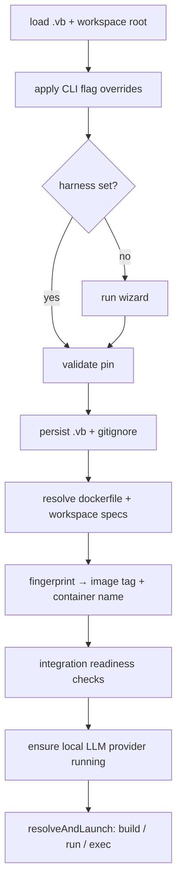

# Architecture

A map of how Vibrator is put together internally, for contributors and the curious. The
code is a single Go module (`github.com/wlame/vibrator`) with a thin `main` and an
`internal/` tree of focused packages.

## Module map

| Package | Responsibility |
|---------|----------------|
| `cmd/vibrate` | Thin `main` — wires the Cobra root command. |
| `internal/cli` | Every subcommand in its own file (run, build, wizard, extensions, …). |
| `internal/app` | The orchestrator. The full decision tree: load pin → flags → wizard → validate → save → resolve specs → readiness checks → local-LLM startup → build/run/exec. Topmost package; imports everything below. |
| `internal/wizard` | The [charmbracelet/huh](https://github.com/charmbracelet/huh) form chain with adaptive gating. |
| `internal/config` | The `.vb` TOML loader/writer and the `Pin` struct. |
| `internal/harness` | The `Harness` interface + one implementation per built-in agent. |
| `internal/feature` | Base features and the topological dependency resolver. |
| `internal/profile` | The minimal/backend/frontend/full bundles over features. |
| `internal/extensions` | Markdown + YAML-frontmatter loader for the per-harness catalogue. |
| `internal/dockerfile` | The deterministic five-stage Dockerfile generator + build context. |
| `internal/docker` | A `Client` interface over the `docker` CLI (production + mock). |
| `internal/runtime` | Docker socket auto-detection across runtimes. |
| `internal/workspace` | Variant fingerprint, image/container/hostname naming. |
| `internal/integration` | Integration registry + runtimes (process / docker / compose) + [serena](../integrations/serena.md)/[claude-mem](../integrations/claude-mem.md). |
| `internal/hostprobe` | Scans the host for installed harness plugins. |
| `internal/prereq` | Host-side prereq verifiers/bootstrappers (HTTP/command/file probes; claude-mem). |
| `internal/localprovider` | Ollama / LM Studio lifecycle. |

The catalogue (`extensions/`) and runtime scripts/shells (`templates/`) are
[embedded](#embedded-assets) into the binary.

## The orchestration flow

Each step is a small function in `internal/app`. The terminal operations (build, run, exec,
login) are indirection seams, so the decision logic can be unit-tested against a mock
`docker.Client` without touching a real daemon.

## Key design decisions

| Decision | Choice | Why |
|----------|--------|-----|
| Docker integration | Shell out to the `docker` CLI | No SDK dependency; works with any Docker-compatible runtime. |
| `.vb` format | TOML (`BurntSushi/toml`) | Human-readable, hand-editable, stable diffs. |
| Extensions format | Markdown + YAML frontmatter, one file per item | "Add a plugin" is a docs change, not Go code. |
| Harness extensibility | Built-in Go interface | A new harness is a reviewed PR; the surface stays small and typed. |
| Wizard | `charmbracelet/huh`, gated step-by-step | Skips anything already supplied via flags/pin. |
| Variant identity | SHA-256 prefix over the canonical spec | Order-independent, reproducible image/container naming. |
| Container reuse | Single-path workspace mount + label-driven discovery | Paths match host; objects are discoverable and prunable. |
| Determinism | Byte-identical Dockerfile per spec | Golden tests, content fingerprints, inspectable builds. |
| Release | Manual GitHub UI release → CI attaches assets | Per-platform binaries + checksums uploaded on publish; notes stay hand-written. |

## Embedded assets

Two `embed.FS` trees are compiled into the binary:

- **`extensions/`** — the per-harness catalogue (`<harness>/<id>.md`), loaded by
  `internal/extensions`.
- **`templates/`** — shell rc files (`shells/`) and runtime scripts (`scripts/`:
  `entrypoint.sh`, `claude-exec.sh`, `welcome.sh`), extracted into the
  [build context](../lifecycle/build.md#the-build-context).

Consistency tests guard these — e.g. every registered harness must have an `extensions/`
directory, every entry's `deps.features` must resolve, and the `ecc-*` commit pins must
agree.

## Adding things

| To add… | Do… |
|---------|-----|
| an extension / MCP / skill | drop a `.md` file under `extensions/<harness>/` |
| a harness | implement the `Harness` interface + register it (PR) |
| a feature | append a `Feature` (with Dockerfile fragment) to the registry |
| an integration | add a descriptor that self-registers, with `LaunchChecks` |

## Related pages

- [What happens on build](../lifecycle/build.md) / [on start](../lifecycle/startup.md).
- [Harnesses](../guides/harnesses.md) · [Features](features.md) ·
  [Extensions](../guides/extensions.md) · [Integrations](../guides/integrations.md).
